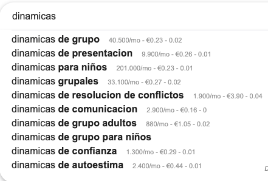
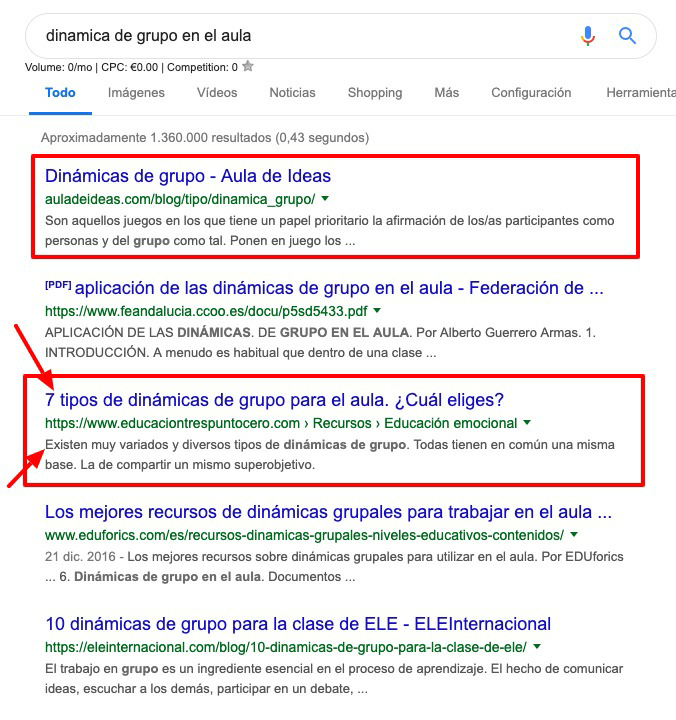

# Glosario SEO: entendiendo el mapa para no perdernos {#glosario-seo-entendiendo-el-mapa-para-no-perdernos}

En este glosario te explico brevemente y de manera ejemplificada algunos términos que aparecen más adelante en el curso.  Además, estas explicaciones también te sirven para interpretar correctamente los artículos que leas por tu cuenta para ampliar información sobre SEO.

*   SEO: search engine optimization. tal y como ya he comentado, optimización del site de cara a buscadores.

*   seo on page: son todas las tareas de optimización que se realizan dentro del propio site (página web o blog)

*   URL (Uniform Resource Localizator): siglas que se utilizan para denominar a aquella dirección específica que se le asigna a cada página web para facilitar el acceso a cualquier usuario.

*   ejemplos: [https://moodle.catedu.es/](https://www.google.com/url?q=http://moodle.catedu.es/&sa=D&ust=1571400723286000) esto es una url.[^b] 

*   Palabra clave o keyword: palabra o conjunto de palabras que utilizamos los usuarios en un buscador para encontrar la información que deseamos.

*   por ejemplo: “inteligencia emocional en el aula”

Existen diferentes tipos de palabra clave: generales, lsi y long tail. Las vemos en profundidad en el punto “conviértete en un maestro del keyword research”

*   Intención de búsqueda: cuando realizamos una búsqueda en google, nuestra intención puede ser:

*   navegacional: el usuario sabe dónde quiere ir, pero desconoce la url exacta

*   ejemplos: amazon, ing

*   informacional: queremos resolver una duda, ampliar información, confirmar unos datos, etc.

*   ejemplos: cómo mejorar la comunicación con un adolescente, dinámicas de grupo para el aula

*   comercial: el usuario se encuentra en un estado más cercano a la compra

*   ejemplos: precio zapatillas adidas mujer, mejor drone para niños

*   transaccional: el usuario está bastante decidido a realizar una acción determinada (comprar, dejarnos su email, etc.)

*   ejemplos: comprar entrada concierto ticketea

Si quieres ampliar información sobre la intención de búsqueda, te dejo enlace a este artículo que escribí para el blog de webpositer (agencia SEO y de Marketing): [https://www.webpositer.com/blog/intencion-de-busqueda-en-seo.html](https://www.google.com/url?q=https://www.webpositer.com/blog/intencion-de-busqueda-en-seo.html&sa=D&ust=1571400723287000)

*   volumen de búsqueda: el interés de una palabra clave depende, entre otros factores, de su volumen de búsqueda y competencia. Con volumen de búsqueda nos referimos a la cantidad de usuarios que utilizan esa palabra clave cada mes para realizar una búsqueda en google.

Por ejemplo, “dinámicas de grupo” se busca 40.500 veces al mes (no solo España, sino todo el mercado español)

*   Competencia: es otro de los grandes factores que se tiene en cuenta a la hora de elegir una u otra palabra clave a la que orientar un contenido. Como veremos más adelante, cuánto más generalista es una palabra, mayor volumen de búsqueda tendrá, pero también de competencia. Cuánto más específica, menor volumen y competencia.

*   antes de elegir una palabra clave, hay que analizar que otras páginas responden a esa misma keyword. Si la competencia es elevada, habrá que estrujarse un poco más el cerebro y darle una vuelta.

*   Autoridad: este término está muy relacionado con el de competencia. La autoridad de una página (mayor o menor confianza a ojos de google) depende de numerosos factores, entre los que destacan la antigüedad de la misma y la calidad de los enlaces que recibe.

*   por ejemplo: elpais.com es una página con muchísima autoridad.
*   Si al analizar a la competencia de una keyword vemos que en top 10 la mayoría son páginas de muchísima autoridad, lo mejor será elegir otra palabra clave.
*   la autoridad de una página se puede ver con la extensión Mozz, pero esto lo vemos más adelante.

*   Encabezados (headers): los encabezados de una página sirven para estructurar el contenido de la misma. Nos encontramos con H1 (header 1) , h2, h3\. El H1 es el más importante y solo debe haber uno por url.

*   Para hacer un buen uso de los mismos, hay que imaginar una muñeca matrioska, de tal forma que un H2 nunca debe preceder a un H1, ni un h3 a un h2 y así sucesivamente.
*   En el punto de redacción SEO veremos la importancia de realizar un buen uso de los encabezados.

*   Snippets: así se denominan a los resultados que aparecen al realizar una búsqueda en google. Cada snippet está formado al menos de un título (title) y descripción (metadescription)  

*   En los recuadros rojos destaco dos snippets y con las flechas apunto a un título y una descripción.
*   con esta herramienta gratuita online [https://seomofo.com/snippet-optimizer.html](https://www.google.com/url?q=https://seomofo.com/snippet-optimizer.html&sa=D&ust=1571400723290000)  puedes ver cómo queda el snippet antes de publicar. De esta manera podrás optimizarlo evitar que el título aparezca cortado o la descripción con puntos suspensivos.
*   Si te estás preguntando donde puedes escribir o modificar esta información, tranquil@, en el curso te enseño cómo.

*   CTR (click through rate): es decir, el número de clics que recibe un snippet divido entre su número de impresiones.

*   si el snippet está bien optimizado y resulta atractivo, recibirá más clics y, por tanto, el CTR será mayor. Si por el contrario, no se cuida y pasa desapercibido, el CTR será menor. Al no conseguir clics, google entenderá que el contenido no interesa, y le hará perder posiciones.

*   sitemap.xml: es un archivo con extensión xml que recoge todas las urls accesibles y más importantes para que los buscadores puedan llegar a ellas.

*   si coges cualquier web y pones al final sitemap.xml podrás ver su archivo (si es que lo tienen, que deberían)
*   ejemplo: [https://www.educaciontrespuntocero.com/sitemap.xml](https://www.google.com/url?q=https://www.educaciontrespuntocero.com/sitemap.xml&sa=D&ust=1571400723292000)

*   robots.txt: es un archivo con extensión .txt que sirve para indicarle al buscador en qué partes de nuestra web y/o blog puede acceder y en cuáles no. También sirve para indicarle en qué url se encuentra nuestro sitemap.

*   ejemplo: [https://www.educaciontrespuntocero.com/robots.txt](https://www.google.com/url?q=https://www.educaciontrespuntocero.com/robots.txt&sa=D&ust=1571400723292000)

*   Error 404: se trata de un código respuesta que indica que el usuario no puede acceder a una determinada url porque ésta no funciona. Puede darse por varios motivos, uno de ellos, modificar una url cuando ésta ya había sido publicada.

*   en el punto “trabajando el seo on page” te doy  alguna herramienta para que puedas revisar estos errores 404 y darles solución.  

*   WPO o velocidad de carga: hace referencia al tiempo que tarda una página en estar disponible desde que el usuario hace clic en la misma. Es un factor muy importante de cara al posicionamiento.

*   en el punto “trabajando el seo on page” te muestro alguna herramienta para revisar la velocidad de carga. En algunos casos se necesita ayuda técnica para mejorarla.

*   Plugins: son aplicaciones o software que han llegado para facilitarnos la vida. Gracias a los plugins podemos implementar soluciones técnicas sin necesidad de conocer código o programación. Ahora bien, no hay que abusar de los plugins ya que ralentizan la velocidad de carga.

*   te daré un listado de los plugins imprescindibles para tu blog docente.

*   link building: es la tarea que consiste en conseguir enlaces de terceros. Si recuerdas, la autoridad de una web depende en gran manera de la calidad de los enlaces que recibe.

*   hoy en día es prácticamente imposible posicionar contenido sin enlaces.

*   anchor text: término relacionado con la tarea del link building. Denominamos anchor text o texto ancla a la palabra o conjunto de palabras que sirven para enlazar una página con otra.

*   por ejemplo: cuando lees un texto y en este texto hay un enlace, las palabras que sirven de enlace, son el anchor text.

*   datos estructurados (schema.org) : los datos estructurados consiste en una serie de etiquetas que describen el contenido que se encuentra en una página web, ayudando a los buscadores a entender la información.

*   en el punto “trabajando el seo on page” volvemos y ampliamos información sobre los datos estructurados.

*   niveles de click: son el número de clicks que necesitamos desde la home o página principal hasta llegar a una información concreta. Lo idóneo es no superar los tres niveles de clics en una página web.

*   index/ no index: se trata de dos metaetiquetas que le dicen a google si deben mostrar o no una url determinada en los resultados de búsqueda:

*   index: google debe mostrar el resultado
*   no index: no quieres que lo muestre

En el caso de un blog docente lo veo súper interesante ya que puedes escribir un artículo que quieres que llegue a numerosas personas (index), pero también puedes escribir un post-tarea solo para tus alumnos que no quieres que aparezca en google (noindex).

Más adelante, cuando os hable del plugin Yoast SEO os explico donde se elige poner una u otra metaetiqueta.

*   follow/ no follow: de la misma manera, son dos metaetiquetas que se aplican a los enlaces y que le dicen a google si deben o no deben seguirlos.

*   follow: google debe seguir el enlace
*   nofollow: no debe seguirlo

Se trata de un aspecto técnico que requiere una mayor comprensión de SEO por lo que no vamos a entrar más en ello. Tan solo que os suene.

Y hasta aquí el glosario SEO. Podría introducir muchísimos más términos, aunque considero que la lista de conceptos que hemos abordado es suficiente para que entiendas sin problema el resto del temario.

Seguimos profundizando en el interesante mundo de usuarios y buscadores, si bien en este punto del camino introducimos la práctica. A lo largo de los siguientes bloques de contenido te pediré que realices diferentes ejercicios para que vayas consolidando el aprendizaje.

¡Continuamos!

[^b]: